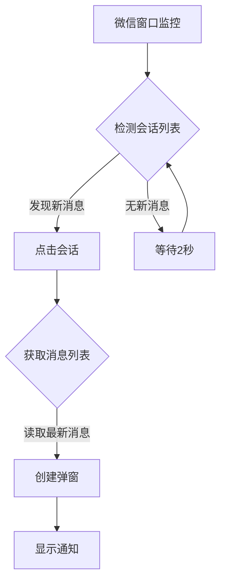

# 微信消息弹窗 / WeChat Notification Popup
**中文版 | [English Version](./README_EN.md)**

---

## 微信消息弹窗 - Windows微信消息提醒工具 (Beta)


**微信消息弹窗** 是一个基于Python开发的Windows微信消息提醒工具，解决了官方客户端在后台运行时无法显示新消息弹窗的问题。本工具提供美观的弹窗通知，包含微信图标、好友昵称和消息内容显示。

> **注意**: 当前为Beta版本，存在已知限制。欢迎开发者贡献代码解决后台检测问题！

### 🌟 功能亮点
#### 🪟 消息弹窗提醒
- 在屏幕左上角显示消息弹窗（后续版本将支持位置自定义）
- 完整显示好友昵称和消息内容
- 自动显示当前时间标记

#### 🖼️ 微信图标支持
- 内置微信应用图标（WCLogo.png）
- 自动适应不同分辨率
- 图标加载失败时显示绿色替代图标

  

#### 🛠️ 后台监控
- 实时监控微信会话列表
- 自动识别新消息并触发弹窗
- 支持多消息批量处理

#### 📌 系统托盘集成
- 后台运行时在系统托盘显示微信图标
- 提供便捷的退出选项
- 状态提示功能

### ⚠️ 已知问题 (Beta版本限制)
1. **后台检测限制**：
   - 当前版本仅在微信窗口处于打开状态时才能检测新消息
   - 当微信最小化到系统托盘或后台运行时，无法检测新消息
   - *寻求帮助：欢迎有大佬指点如何解决后台消息检测问题！*

2. **位置固定**：
   - 弹窗目前固定在屏幕左上角（后续版本将支持位置自定义）

3. **依赖要求**：
   - 需要完整安装Python环境及依赖库
   - 需要正确配置微信安装路径

### 📦 安装与使用
#### 系统要求
- Windows 10 或更高版本
- Python 3.7+
- 已安装官方微信桌面版

#### 安装步骤
1. 克隆本仓库或下载源代码：
   ```bash
   git clone https://github.com/Dreamirage-Studio/WeChat-Message-Pop-up.git
   ```
   cd到存放py文件的位置

2. 安装依赖库：
   ```bash
   pip install -r requirements.txt
   ```

3. 配置微信安装路径：
   - 打开 `wechat-message-pop-up.py` 文件（编辑而不是双击打开）
   - 修改 `self.wechat_install_path` 为你的微信安装路径（例如：`r"D:\Program Files\WeChat"`）

4. 运行程序：
   ```bash
   python wechat-message-pop-up.py
   ```

#### 使用说明
1. 确保微信已登录并保持窗口打开（非最小化到托盘）
2. 程序启动后，将在系统托盘显示微信图标
3. 收到新消息时，屏幕左上角将显示弹窗通知
4. 右键点击系统托盘图标选择"退出"可关闭程序

### 🧩 技术细节
#### 实现原理


#### 核心依赖
- `uiautomation` - Windows UI自动化控制
- `pystray` - 系统托盘图标支持
- `Pillow` - 图像处理
- `tkinter` - 图形界面弹窗

#### 文件结构
```
wechat-message-pop-up/
├── wechat-message-pop-up.py   # 主程序
├── WCLogo.png           # 微信图标
├── requirements.txt     # 依赖列表
├── README.md            # 说明文档
└── LICENSE              # 许可证文件
```

### ❓ 常见问题
#### Q: 为什么收不到消息提醒？
A: 请检查：
1. 微信窗口是否处于打开状态（非最小化到托盘）
2. 配置的微信安装路径是否正确
3. 控制台是否有错误输出

#### Q: 弹窗位置可以调整吗？
A: 当前版本固定在左上角，后续版本将支持自定义位置。开发者可自行修改代码中的弹窗位置（`create_popup`函数内的`x`和`y`坐标）。

#### Q: 如何实现后台运行？
A: 当前版本无法在微信后台运行时检测消息，这是已知限制。欢迎贡献代码解决此问题！

#### Q: 是否支持企业微信？
A: 当前仅支持个人微信。

### 🤝 寻求贡献
我们特别需要解决以下问题：
- **后台消息检测**：当微信最小化到托盘或后台时如何检测新消息？
- **更可靠的消息捕获**：改进消息捕获机制，避免漏消息
- **弹窗位置自定义**：实现用户可配置的弹窗位置

欢迎提交Pull Request或Issue讨论解决方案！

### 🧪 开发指南
1. 安装开发依赖：
   ```bash
   pip install -r requirements.txt
   ```

2. 代码主要结构：
   - `WeChatNotifier` 类：主程序逻辑
   - `get_wxid()`：获取当前微信用户ID
   - `get_avatar_path()`：获取联系人头像
   - `create_popup()`：创建消息弹窗
   - `monitor_wechat()`：微信消息监控循环

3. 调试提示：
   - 启用详细日志输出
   - 检查微信会话列表的UI结构变化
   - 测试不同微信版本兼容性

   - 检查微信会话列表的UI结构变化
   - 测试不同微信版本兼容性

### 📜 许可证
本项目采用 MIT 许可证 - 详情请参阅 [LICENSE](LICENSE) 文件。

### 📞 联系作者
- 开发者: mirage彬
- 邮箱: [dreamirage@asia.com] 或 [miragebinting@gmail.com(推荐)]
- 项目地址: https://github.com/Dreamirage-Studio/WeChat-Message-Pop-up

---

**微信消息弹窗** © 2025 Dreamirage Studios。开源项目，欢迎贡献！