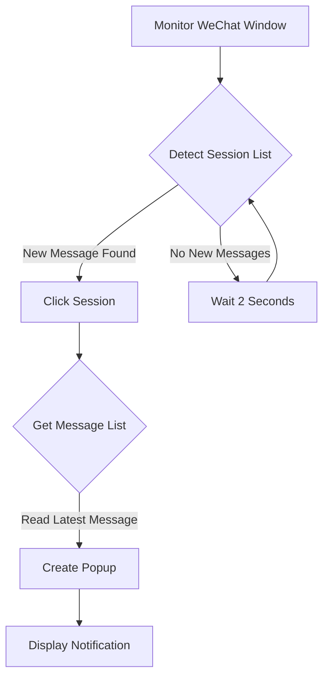

# WeChat Notification Popup

**[中文版](./README.md) | English Version**

-----

## WeChat Notification Popup - A Windows WeChat Notification Tool (Beta)

   

**WeChat Notification Popup** is a Windows WeChat notification tool developed in Python. It solves the problem where the official desktop client doesn't show new message popups when running in the background. This tool provides elegant popup notifications that include the WeChat icon, the sender's nickname, and the message content.

> **Note**: This is a Beta version with known limitations. Developers are welcome to contribute code to solve the background detection issue\!

### 🌟 Features

#### 🪟 Popup Notifications

  - Displays message popups in the top-left corner of the screen (customizable positions will be supported in future versions).
  - Shows the full nickname of the sender and the message content.
  - Automatically displays the current timestamp.

#### 🖼️ WeChat Icon Support

  - Includes a built-in WeChat application icon (`WCLogo.png`).

  - Automatically adapts to different screen resolutions.

  - Displays a green alternative icon if the main icon fails to load.

    \

#### 🛠️ Background Monitoring

  - Monitors the WeChat session list in real-time.
  - Automatically identifies new messages and triggers a popup.
  - Supports batch processing for multiple messages.

#### 📌 System Tray Integration

  - Displays a WeChat icon in the system tray while running in the background.
  - Provides a convenient "Exit" option.
  - Includes status notifications.

### ⚠️ Known Issues (Beta Version Limitations)

1.  **Background Detection Limitation**:

      - The current version can only detect new messages when the WeChat window is open.
      - It cannot detect new messages when WeChat is minimized to the system tray or running in the background.
      - *Help Wanted: We are looking for developers who can help solve the issue of background message detection\!*

2.  **Fixed Position**:

      - Popups are currently fixed in the top-left corner of the screen (customizable positions will be supported in future versions).

3.  **Dependency Requirements**:

      - Requires a full Python environment and its dependencies to be installed.
      - The WeChat installation path must be configured correctly.

### 📦 Installation and Usage

#### System Requirements

  - Windows 10 or later
  - Python 3.7+
  - Official WeChat for Desktop installed

#### Installation Steps

1.  Clone the repository or download the source code:

    ```bash
    git clone https://github.com/Dreamirage-Studio/WeChat-Message-Pop-up.git
    ```

    `cd` into the directory where the `.py` file is located.

2.  Install the required libraries:

    ```bash
    pip install -r requirements.txt
    ```

3.  Configure the WeChat installation path:

      - Open the `wechat-message-pop-up.py` file (edit it, do not double-click to run).
      - Modify `self.wechat_install_path` to your WeChat installation directory (e.g., `r"D:\Program Files\WeChat"`).

4.  Run the program:

    ```bash
    python wechat-message-pop-up.py
    ```

#### How to Use

1.  Ensure WeChat is logged in and the window is open (not minimized to the tray).
2.  After the program starts, a WeChat icon will appear in the system tray.
3.  When a new message is received, a popup notification will appear in the top-left corner of the screen.
4.  Right-click the system tray icon and select "Exit" to close the program.

### 🧩 Technical Details

#### How it Works



#### Core Dependencies

  - `uiautomation` - For Windows UI automation control.
  - `pystray` - For system tray icon support.
  - `Pillow` - For image processing.
  - `tkinter` - For the graphical interface popup.

#### File Structure

```
wechat-message-pop-up/
├── wechat-message-pop-up.py   # Main script
├── WCLogo.png                 # WeChat icon
├── requirements.txt           # Dependency list
├── README.md                  # Readme file
└── LICENSE                    # License file
```

### ❓ FAQ

#### Q: Why am I not receiving message notifications?

A: Please check the following:

1.  Is the WeChat window open (not minimized to the tray)?
2.  Is the configured WeChat installation path correct?
3.  Are there any error messages in the console?

#### Q: Can the popup position be adjusted?

A: The position is fixed in the top-left corner in the current version. Future versions will support customization. Developers can modify the popup position (`x` and `y` coordinates in the `create_popup` function) in the code.

#### Q: How can I make it run in the background?

A: The current version cannot detect messages when WeChat is running in the background. This is a known limitation. Contributions to solve this issue are welcome\!

#### Q: Does it support WeChat Work (WeCom)?

A: It currently only supports the personal version of WeChat.

### 🤝 Seeking Contributions

We are particularly looking for help with the following issues:

  - **Background Message Detection**: How to detect new messages when WeChat is minimized to the tray or running in the background.
  - **More Reliable Message Capturing**: Improve the message capture mechanism to prevent missed messages.
  - **Customizable Popup Position**: Implement a user-configurable popup position.

We welcome Pull Requests or Issues to discuss solutions\!

### 🧪 Development Guide

1.  Install development dependencies:

    ```bash
    pip install -r requirements.txt
    ```

2.  Main code structure:

      - `WeChatNotifier` class: Contains the main application logic.
      - `get_wxid()`: Gets the current WeChat user ID.
      - `get_avatar_path()`: Gets the contact's avatar.
      - `create_popup()`: Creates the message popup window.
      - `monitor_wechat()`: The main loop for monitoring WeChat messages.

3.  Debugging tips:

      - Enable detailed log output.
      - Check for changes in the UI structure of the WeChat session list.
      - Test compatibility with different WeChat versions.

### 📜 License

This project is licensed under the MIT License - see the [LICENSE](https://www.google.com/search?q=LICENSE) file for details.

### 📞 Contact Author

  - Developer: mirage彬
  - Email: [dreamirage@asia.com] or [miragebinting@gmail.com (Recommended)]
  - Project Link: [https://github.com/Dreamirage-Studio/WeChat-Message-Pop-up](https://github.com/Dreamirage-Studio/WeChat-Message-Pop-up)

-----

**WeChat Notification Popup** © 2025 Dreamirage Studios. Open source project, contributions are welcome\!